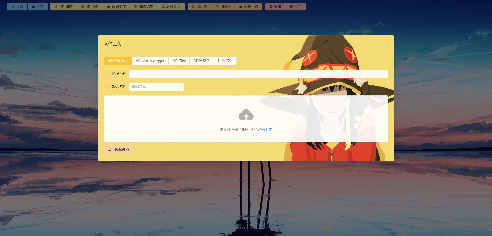
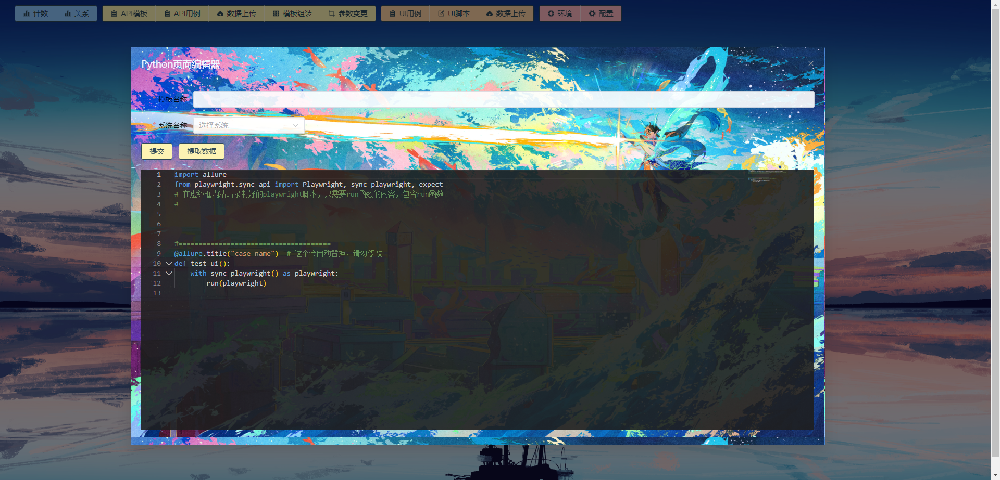
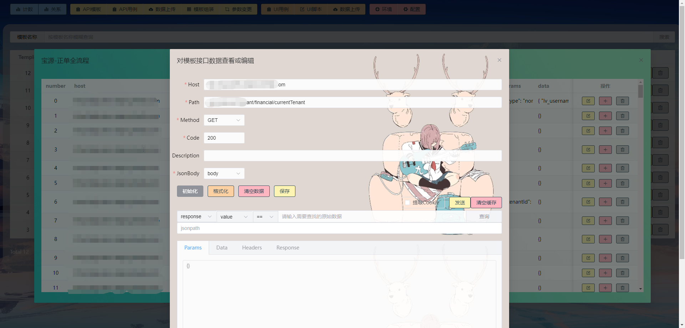

### 随便测测

* 博客：https://blog.csdn.net/yangj507/category_12359965.html
* 后端：https://gitee.com/myjiee/fast-api_auto_test
* 后端：https://github.com/My-Jie/FastApi_auto_test
* 主页：http://localhost:8000/index.html
* swagger-ui: http://localhost:8000/docs

### 来点图片

### 部署方式

#### Python 后端
* 未采用docker容器部署，可自行尝试
* 建议使用Python3.8以上版本
* 环境安装：pip install -r requirements.txt 或 pip3 install -r requirements.txt
* 创建一个目录，将项目文件拷贝到目录下
* 可使用python main.py 或 python3 main.py 直接启动
* 或使用命令：nohup uvicorn main:app --host 0.0.0.0 --port 9999(自定义端口)启动
* 若启动过程中提示还有未安装的库，请根据提示自行使用 pip 安装
* setting.py 文件夹需要设置：ALLURE_PATH(allure报告存放路径)、LOG_PATH(日志路径)、HOST(allure访问路径)
* 接口文档：http://ip:port/docs

#### vue3 前端
* 前端编译环境：vite+vue3+element-plus
* 建议使用vscode编辑器，vite构建工具可自行搜索下载
* npm install 安装第三方库
* npm run dev 启动dev环境
* npm run build 打包，默认打包目录在同级文件目录下的 dist 文件夹
* 在 python 后端根目录下新建 static 文件夹
* 将 dist 文件夹内的3个文件，拷贝到 static 目录下
* 主页：http://ip:port/index.html

#### 交流群: 599733338