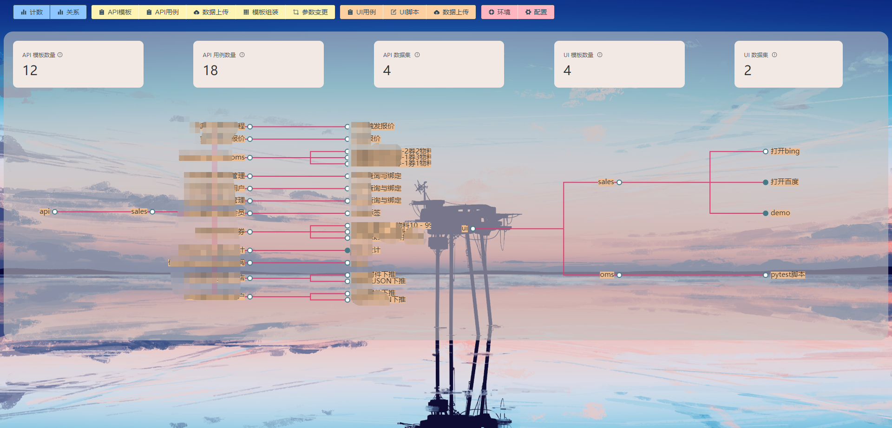
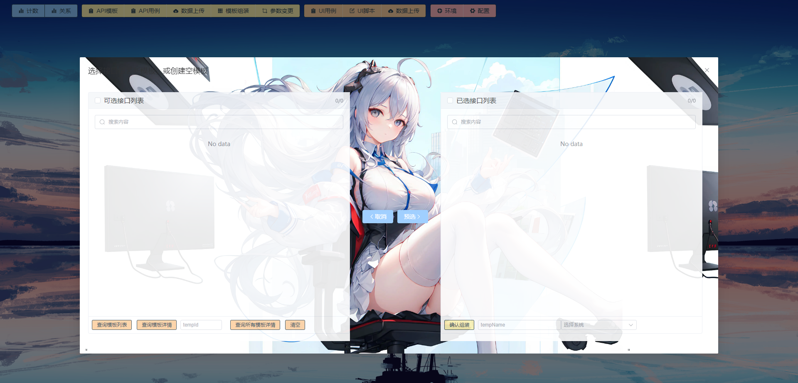

# 随便测测平台
**随心、随意、随景**

* api和ui自动化测试综合测试平台
* 非传统测试平台设计，无全局变量、环境变量、临时变量的设定
* 使用接口运行时自带的Number，进行上下级数据关联
* 操作简便、平铺式展开api所有内容，方便查看和预览
* 使用Playwright录制ui用例，可选的Selenoid远程浏览器，python在线代码编辑器
* allure测试报告
* 二次元Saber (二次元就是第一生产力！)

>自动化用例如何快速成型，呐！就是这个。
>
>在继续阅读前，心理上请预先接受2个设定：

    1.api自动化 倾向于业务流程
    2.ui自动化  倾向于界面交互
    
>在用例快速成型的目标前提下，我们需要约束好它们各自能力的范围
>
>“快速编写用例”，这正是这个平台设计的初衷。从测试人员的角度出发，使测试人员用的舒畅，写的舒服，不对软件使用的复杂度而望而生畏，
>以此为目的再去完善周边功能
>
>让编写自动化用例，赶得上测试用例设计

## api测试用例流程

* 有模板-用例-数据集的概念，1个模板可以生成N个用例，1个用例可以挂载N个数据集
* 数据源来源于Swagger、charles.har (数据来源是可扩展的，按模板格式存入即可)

>数据来源的扩展：只需要针对性的去解析不同格式的文件，按统一的数据模板保存即可
> 
>如postman, jmeter，yapi 等
> 
>模板是可以任意组装的，数据来源只是收录api的不同方式

[随便测测-做接口测试](https://blog.csdn.net/yangj507/article/details/131395093)

## ui测试用例流程

* 有模板-数据集的概念，1个模板挂载N个数据集
* 没有采用POM设计 （我们确定了ui的测试范围：页面交互）

>为什么没有采用POM设计，在这里不需要
>
>界面交互通常情况下是点对点的测试，没有复杂的业务背景，也就不需要分层设计、数据剥离

    当改动较小，在线编辑修改脚本内容即可
    当改动较大，删除文本内容重新录制即可
    
[随便测测-做UI测试](https://blog.csdn.net/yangj507/article/details/131579327)

### 随便测测

* 博客：https://blog.csdn.net/yangj507/category_12359965.html
* 后端：https://gitee.com/myjiee/fast-api_auto_test
* 后端：https://github.com/My-Jie/FastApi_auto_test
* 主页：http://localhost:8000/index.html
* swagger-ui: http://localhost:8000/docs

### 来点图片

### 部署方式

#### Python 后端
* 未采用docker容器部署，可自行尝试
* 建议使用Python3.8以上版本
* 环境安装：pip install -r requirements.txt 或 pip3 install -r requirements.txt
* 创建一个目录，将项目文件拷贝到目录下
* 可使用python main.py 或 python3 main.py 直接启动
* 或使用命令：nohup uvicorn main:app --host 0.0.0.0 --port 9999(自定义端口)启动
* 若启动过程中提示还有未安装的库，请根据提示自行使用 pip 安装
* setting.py 文件夹需要设置：ALLURE_PATH(allure报告存放路径)、LOG_PATH(日志路径)、HOST(allure访问路径)
* 接口文档：http://ip:port/docs

#### vue3 前端
* 前端编译环境：vite+vue3+element-plus
* 建议使用vscode编辑器，vite构建工具可自行搜索下载
* npm install 安装第三方库
* npm run dev 启动dev环境
* npm run build 打包，默认打包目录在同级文件目录下的 dist 文件夹
* 在 python 后端根目录下新建 static 文件夹
* 将 dist 文件夹内的3个文件，拷贝到 static 目录下
* 主页：http://ip:port/index.html

#### 交流群: 599733338